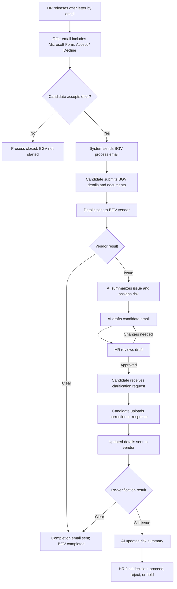

# Agentic AI BGV Workflow

```mermaid
flowchart TD
    A["HR releases offer letter by email"] --> B["Offer email includes Microsoft Form: Accept / Decline"]
    B --> C{"Candidate accepts offer?"}
    C -->|No| D["Process closed; BGV not started"]
    C -->|Yes| E["System sends BGV process email"]
    E --> F["Candidate submits BGV details and documents"]
    F --> G["Details sent to BGV vendor"]
    G --> H{"Vendor result"}
    H -->|Clear| I["Completion email sent; BGV completed"]
    H -->|Issue| J["AI summarizes issue and assigns risk"]
    J --> K["AI drafts candidate email"]
    K --> L["HR reviews draft"]
    L -->|Changes needed| K
    L -->|Approved| M["Candidate receives clarification request"]
    M --> N["Candidate uploads correction or response"]
    N --> O["Updated details sent to vendor"]
    O --> P{"Re-verification result"}
    P -->|Clear| I
    P -->|Still issue| Q["AI updates risk summary"]
    Q --> R["HR final decision: proceed, reject, or hold"]
```
