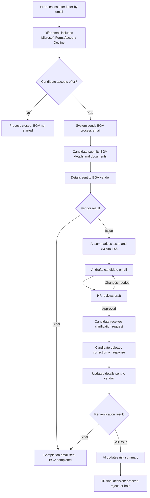

# Agentic AI BGV System

An automated, AI-augmented Background Verification (BGV) workflow system designed to streamline the verification pipeline after an HR offer release. It connects HR teams, candidates, and third-party verification vendors through a single, intelligent console.

---

## 🌟 Pitch & Value Proposition

Traditional background verification is a bottleneck for hiring teams. It involves endless back-and-forth emails, manually reviewing vendor discrepancy logs, chasing candidates for missing documents, and managing disconnected tools.

**Agentic AI BGV** turns this chaotic process into a structured, automated workflow:
- **Intelligent Summaries**: AI evaluates vendor outcomes, highlights exact discrepancies, and assigns risk levels.
- **Automated Communication**: AI automatically drafts personalized clarification requests to candidates, specifying what documents or responses are needed.
- **HR-in-the-Loop**: HR retains full authority, reviewing and approving all draft emails and making the final hiring decisions.
- **Real-Time Timelines**: Every milestone is logged in an audit trail for clear tracking.

---

## 🔄 System Workflow



---

## 🛠️ Tech Stack

- **Backend**: FastAPI (Python 3.12+) — High-performance, asynchronous REST APIs with Swagger documentation.
- **Dashboard**: Streamlit — Dynamic, reactive HR console for live demo and administration.
- **Database**: SQLite & SQLAlchemy ORM — Local transactional and state tracking storage.
- **Schemas**: Pydantic — Strict request/response validation and data serialization.
- **Integrations**: Microsoft Graph API & Microsoft Forms — Production-ready hooks (with sandbox email fallbacks).
- **AI Agent Core**: Rule-based AI Engine — Categorizes verification risks (`Low`, `Medium`, `High`) and drafts precise emails.

---

## 📂 Directory Structure

Here is the structure of the project and what each component does:

```text
BGV Proccess Automation/
│
├── bgv_app/                    # FastAPI Backend Application
│   ├── agents/                 # AI Agent logic & definitions
│   │   ├── definitions.py      # Data structures for AI analysis
│   │   └── runner.py           # Risk assessment and email drafting logic
│   ├── integrations/           # Third-party integrations
│   │   ├── gmail.py            # Local demo fallback mailer
│   │   └── microsoft_forms.py  # MS Forms integration logic
│   ├── routes/                 # FastAPI REST API Routers
│   │   ├── agentic_bgv.py      # BGV core state machine endpoints
│   │   ├── analysis.py         # AI analysis triggers
│   │   ├── bgv.py              # Vendor status and tracking endpoints
│   │   └── candidates.py       # Candidate onboarding endpoints
│   ├── config.py               # Environment configuration loader
│   ├── database.py             # SQLite connection & DB initialization
│   ├── models.py               # SQLAlchemy database models
│   ├── schemas.py              # Pydantic validation schemas
│   └── main.py                 # FastAPI application entry point
│
├── dashboard/                  # Streamlit HR Console Application
│   └── app.py                  # Live React-like HR UI dashboard
│
├── scripts/                    # PowerShell/Python utility scripts
│   ├── check_ms_mail_config.py # Diagnostic script for Microsoft Graph
│   ├── create_workflow_visual.py # Generates a static visual graph
│   ├── install_deps.ps1        # Dependency installation script
│   ├── run_api.ps1             # Backend startup script
│   ├── run_dashboard.ps1       # Dashboard startup script
│   ├── seed_demo.py            # SQLite database seeder
│   └── test_ms_mail.py         # Real-world email testing utility
│
├── Dockerfile                  # Containerization template
├── README.md                   # System documentation (this file)
├── HACKATHON_DEMO.md           # Demo and pitch guide for judges
└── requirements.txt            # Python dependencies
```

---

## 🚀 Setup & Installation

### Prerequisite Setup
1. Open PowerShell and navigate to the project directory:
   ```powershell
   cd "C:\Users\ashutosh\Documents\BGV Proccess Automation"
   ```
2. Copy the sample environment file to `.env`:
   ```powershell
   Copy-Item .env.example .env
   ```
3. Run the installation script to configure the virtual environment and install dependencies:
   ```powershell
   .\scripts\install_deps.ps1
   ```
   *Note: If PowerShell blocks script execution, run the following command first to bypass the restriction:*
   ```powershell
   Set-ExecutionPolicy -Scope Process -ExecutionPolicy Bypass
   ```

4. Seed the database with demo candidates and verification cases:
   ```powershell
   .\.venv\Scripts\python.exe scripts\seed_demo.py
   ```

---

## 🏃 Running the Application

To run the application, you need to start the backend API and the HR dashboard concurrently:

### 1. Start the FastAPI Backend
In your first terminal, run:
```powershell
.\scripts\run_api.ps1
```
- **API Health Check**: [http://127.0.0.1:8000](http://127.0.0.1:8000)
- **Interactive Swagger Docs**: [http://127.0.0.1:8000/docs](http://127.0.0.1:8000/docs)

### 2. Start the Streamlit Dashboard
In a second terminal, run:
```powershell
.\scripts\run_dashboard.ps1
```
- **HR Dashboard Portal**: [http://localhost:8501](http://localhost:8501) (or the URL outputted in the terminal)

---

## 📧 Configuring Microsoft Graph Email (Optional)

The application includes a real-world integration with the Microsoft Graph API. By default, it runs in sandbox demo mode (`GMAIL_DEMO_MODE=true` logs emails to the backend terminal). To send real emails:

1. Register an App in the **Microsoft Entra ID** portal (under App registrations).
2. Assign the Application Permission `Mail.Send` to the application.
3. Grant **Admin Consent** for the tenant.
4. Generate a Client Secret and copy its **Value**.
5. Update your local `.env` file:
   ```env
   GMAIL_DEMO_MODE=false
   MS_TENANT_ID=your-tenant-id
   MS_CLIENT_ID=your-client-id
   MS_CLIENT_SECRET=your-client-secret
   MS_SENDER_EMAIL=your-real-mailbox@yourdomain.com
   ```
6. Verify your mail settings:
   ```powershell
   .\.venv\Scripts\python.exe scripts\check_ms_mail_config.py
   ```
7. Send a test email:
   ```powershell
   .\.venv\Scripts\python.exe scripts\test_ms_mail.py --to your-email@yourdomain.com
   ```

---

## 🎯 Demo Scenarios & Walkthrough

Read [HACKATHON_DEMO.md](HACKATHON_DEMO.md) for full instructions on demonstrating the app.

### Scenario A: Clean Verification Flow
- **Onboard Candidate** -> **Candidate Accepts Offer** -> **Submit Documents** -> **Vendor Approves** -> **Status: Completed**.

### Scenario B: AI Discrepancy Flow (Rohan Mehta)
1. Select the seeded case for **Rohan Mehta** in the dashboard.
2. Note the **AI Risk Assessment** (Medium Risk due to mismatched employment dates).
3. Review the **AI-generated candidate email draft**.
4. Click **Approve Draft** to simulate requesting clarification.
5. Provide a candidate response (e.g. uploading corrected documents).
6. Update vendor status to `Clear`.
7. Verify the case transitions to `Completed` with a clean timeline history.
