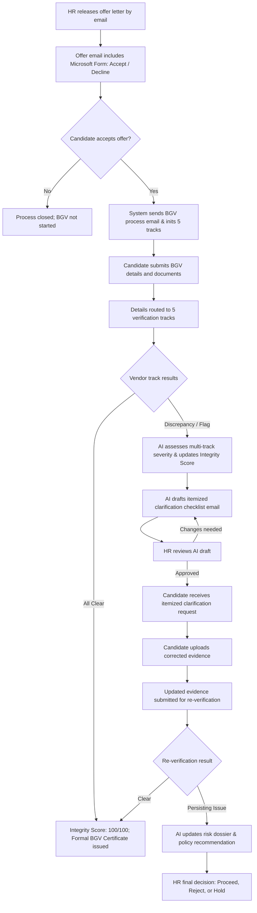

# Agentic AI BGV System

An enterprise-grade, AI-augmented Background Verification (BGV) workflow automation system designed to streamline candidate verification after an HR offer release. It orchestrates HR teams, candidates, and third-party verification vendors through an intelligent, multi-track console.

---

## 🌟 Pitch & Value Proposition

Traditional background verification is a major operational bottleneck for corporate hiring. It involves endless back-and-forth emails, manually reviewing disparate vendor discrepancy logs, chasing candidates for missing documents, and managing disconnected tools.

**Agentic AI BGV** turns this chaotic process into a structured, automated workflow:
- **5-Pillar Verification Tracks**: Granular tracking across Identity, Employment History, Education Credentials, Criminal/Court Records, and Address.
- **Candidate Integrity Scoring (0–100%)**: Quantitative credibility scoring calculated dynamically from component statuses and discrepancy severities.
- **Root-Cause & Policy Advisory AI**: Automatically detects tenure overlap, moonlighting, diploma mills, or address mismatches and recommends specific HR policy actions.
- **Automated Candidate Clarification Packs**: AI generates itemized clarification checklists and ready-to-dispatch candidate emails.
- **Formal Audit Dossier Generator**: One-click generation of tamper-evident, printable HTML/PDF-ready Background Verification Audit Certificates.
- **HR-in-the-Loop Control**: HR retains full governance, reviewing drafts, requesting revisions, and executing the final hiring disposition.

---

## 🔄 System Workflow



---

## 🧩 5-Pillar Verification Matrix

| Track | Scope | Evidence Required | Risk Focus |
|---|---|---|---|
| **🆔 Identity Verification** | National ID, PAN, Aadhaar, Passport | Government Photo ID, DigiLocker | Identity fraud, typographical mismatches |
| **💼 Employment History** | Past employers, tenure dates, designations | Relieving letters, EPFO service history, Form 26AS | Dual employment / Moonlighting, tenure overlap |
| **🎓 Education Credentials** | University accreditation, degree validity | Degree certificate, consolidated marksheets | Unaccredited institutions, diploma mills |
| **⚖️ Criminal & Court Checks** | Civil litigation, police records, high courts | Law enforcement registry, court checks | Adverse judicial records, criminal flags |
| **📍 Address Verification** | Permanent & current residences | Registered rent agreement, utility bills | Geo-mismatch, fake address claims |

---

## 🛠️ Tech Stack

- **Backend**: FastAPI (Python 3.12+) — High-performance asynchronous REST APIs with Swagger documentation.
- **Dashboard**: Streamlit — Dynamic, interactive HR console with real-time KPI metrics, matrix editors, and report viewers.
- **Database**: SQLite & SQLAlchemy ORM — Transactional state tracking and relational models.
- **Schemas**: Pydantic — Strict request/response validation and data serialization.
- **Integrations**: Microsoft Graph API & Microsoft Forms — Production-ready hooks (with demo-safe fallbacks).
- **AI Agent Engine**: Multi-track compliance engine computing Integrity Scores, classifying risk types, and drafting itemized emails.

---

## 📂 Directory Structure

```text
BGV Proccess Automation/
│
├── bgv_app/                    # FastAPI Backend Application
│   ├── agents/                 # AI Agent logic & definitions
│   │   ├── definitions.py      # Data structures for AI analysis & scoring
│   │   └── runner.py           # Integrity scoring, root-cause classification, email generation
│   ├── integrations/           # Third-party integrations
│   │   ├── gmail.py            # Local demo fallback mailer
│   │   └── microsoft_forms.py  # MS Forms integration logic
│   ├── routes/                 # FastAPI REST API Routers
│   │   ├── agentic_bgv.py      # Core state machine, component endpoints & audit reports
│   │   ├── analysis.py         # AI analysis & preview endpoints
│   │   ├── bgv.py              # Vendor status & tracking endpoints
│   │   └── candidates.py       # Candidate onboarding endpoints
│   ├── config.py               # Environment configuration loader
│   ├── database.py             # SQLite connection & DB initialization
│   ├── models.py               # SQLAlchemy database models (Cases, Components, Events, Documents)
│   ├── schemas.py              # Pydantic validation schemas & report models
│   └── main.py                 # FastAPI application entry point
│
├── dashboard/                  # Streamlit HR Console Application
│   └── app.py                  # Live HR UI dashboard with Verification Matrix & Audit Dossiers
│
├── scripts/                    # PowerShell/Python utility scripts
│   ├── check_ms_mail_config.py # Diagnostic script for Microsoft Graph
│   ├── create_workflow_visual.py # Generates a static visual graph
│   ├── install_deps.ps1        # Dependency installation script
│   ├── run_api.ps1             # Backend startup script
│   ├── run_dashboard.ps1       # Dashboard startup script
│   ├── seed_demo.py            # SQLite database seeder with 5-track demo cases
│   ├── test_ms_mail.py         # Real-world email testing utility
│   └── test_new_features.py    # Automated test suite for new features
│
├── Dockerfile                  # Containerization template
├── README.md                   # System documentation
├── HACKATHON_DEMO.md           # Demo and pitch guide for judges
└── requirements.txt            # Python dependencies
```

---

## 🚀 Setup & Installation

### Prerequisite Setup
1. Open PowerShell and navigate to the project directory:
   ```powershell
   cd "C:\Users\ashutosh\Documents\BGV Proccess Automation"
   ```
2. Copy the sample environment file to `.env`:
   ```powershell
   Copy-Item .env.example .env
   ```
3. Run the installation script to configure the virtual environment and install dependencies:
   ```powershell
   .\scripts\install_deps.ps1
   ```
   *Note: If PowerShell blocks script execution, run the following command first:*
   ```powershell
   Set-ExecutionPolicy -Scope Process -ExecutionPolicy Bypass
   ```

4. Seed the database with multi-track demo cases:
   ```powershell
   .\.venv\Scripts\python.exe scripts\seed_demo.py
   ```

---

## 🏃 Running the Application

### 1. Start the FastAPI Backend
In your first terminal, run:
```powershell
.\scripts\run_api.ps1
```
- **API Health Check**: [http://127.0.0.1:8000](http://127.0.0.1:8000)
- **Interactive Swagger Docs**: [http://127.0.0.1:8000/docs](http://127.0.0.1:8000/docs)

### 2. Start the Streamlit Dashboard
In a second terminal, run:
```powershell
.\scripts\run_dashboard.ps1
```
- **HR Dashboard Portal**: [http://localhost:8501](http://localhost:8501)

---

## 🎯 Demo Scenarios & Walkthrough

### Scenario 1: Clean Verification (Anita Sharma)
- Candidate accepted offer.
- All 5 tracks verified clear.
- **Integrity Score**: 100/100 (Low Risk).
- Click **Audit Dossier** to view the official compliance clearance report.

### Scenario 2: Address Mismatch Discrepancy (Rohan Mehta)
- **Integrity Score**: 75/100 (Medium Risk).
- Address verification flagged due to utility bill mismatch.
- AI generated an itemized clarification pack requesting registered lease agreement or utility bill dated within 60 days.
- HR approves draft, candidate submits correction, case clears upon re-verification.

### Scenario 3: High-Risk Moonlighting / Dual Employment (Priya Nair)
- **Integrity Score**: 40/100 (High Risk).
- Employment track flagged for concurrent salary credits and EPFO contributions.
- AI outputs **Policy Alert [HR-3.2]** recommending Form 26AS cross-audit and escalation to Head of HR.
- Case held pending ethics committee resolution.

### Scenario 4: One-Click Vendor Simulation
- Use the quick simulation buttons on the **Actions** tab to test:
  - `✅ Simulate All Clear`
  - `⚠️ Simulate Discrepancy`
  - `🚨 Simulate Critical Red Flag`
